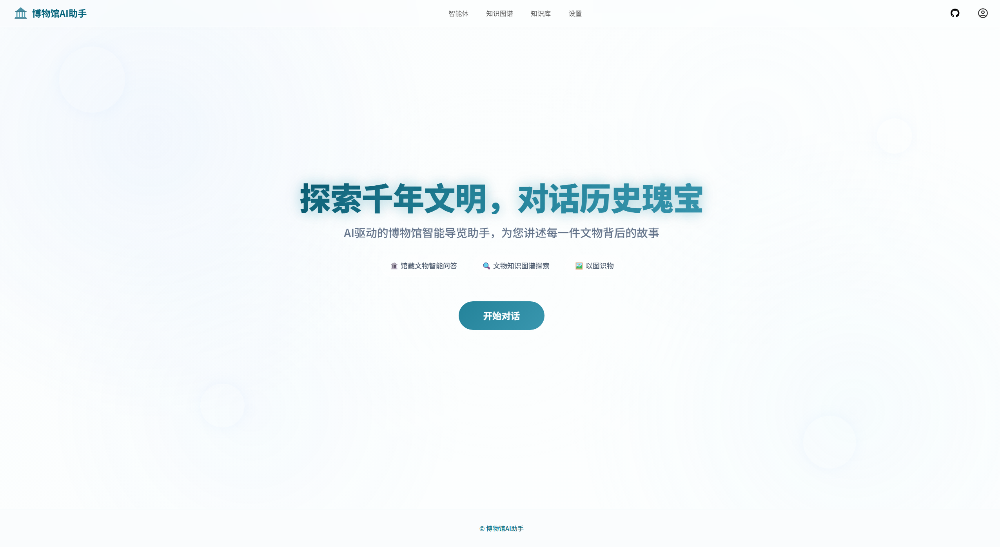
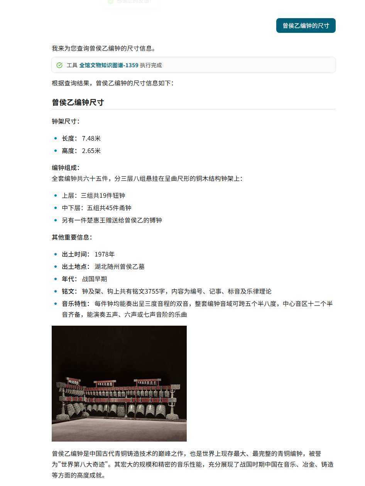
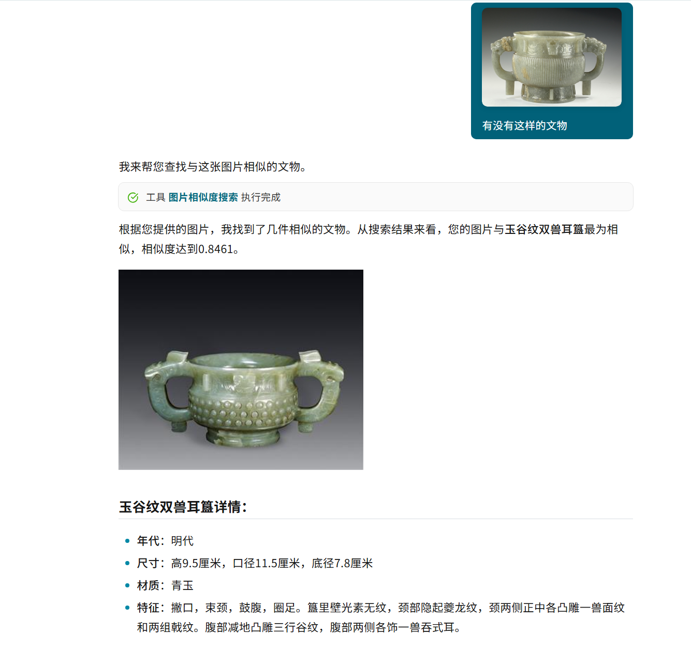
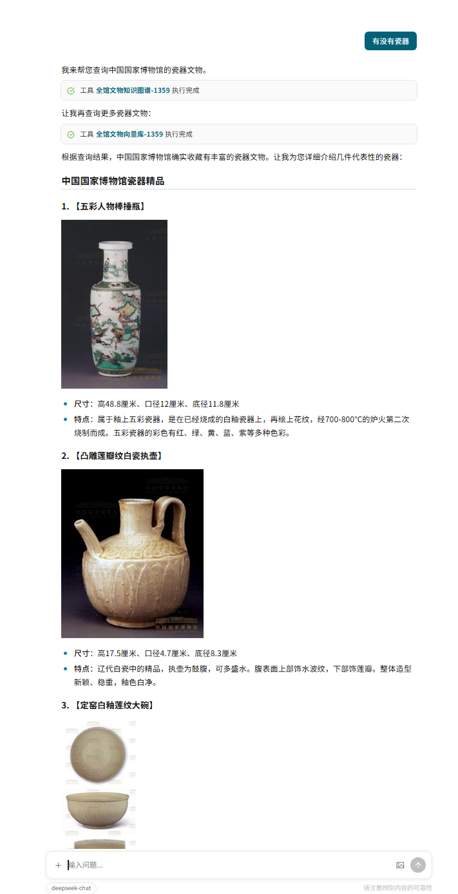

<h1 align="center">Museum-AI: 智能博物馆知识问答与多模态检索系统</h1>

<p align="center">
  <a href="LICENSE"></a>
  <a href="https://www.python.org/"></a>
</p>

<p align="center">
  博物馆智能知识库与对话系统，基于 LangGraph 和 LangChain 构建的智能助手，专注于博物馆文物领域的知识管理和智能问答。
</p>

## 📸 项目预览

<p align="center">
  
</p>

| 智能问答 | 以图识物 | 藏品检索 |
|-------|-------|-------|
|  |  |  |

## 🏗️ 系统架构

<p align="center">
  
</p>

### 核心特性

- **多模态知识库管理**
  - 支持 ChromaDB 向量数据库（语义检索）
  - 支持 LightRAG 知识图谱（复杂推理）
  - 支持多种文件格式：PDF、图片、文本、CSV、JSON 等
  - 图片嵌入支持（基于 CN-CLIP 模型）

- **智能体系统**
  - ChatbotAgent：主力智能体，内置 Router 意图分类（chat/simple/complex），自动选择检索策略
  - ReActAgent：通用 ReAct 智能体，绑定所有工具，适用于灵活任务
  - 支持动态工具调用，LLM 自主决定调用哪些知识库和工具
  - 预留 MCP（Model Context Protocol）工具扩展接口
  - 基于 LangGraph 构建的状态机工作流

- **知识图谱**
  - 基于 Neo4j 的图存储
  - 预定义博物馆文物领域的实体/关系 Schema，由 LLM 自动抽取构建知识图谱
  - 检索模式：naive（纯向量检索）和 mix（图谱推理 + 向量检索），由 Router 自动选择

- **安全与认证**
  - 登录频率限制（60秒内最多10次）
  - API 权限管理（管理员/普通用户分级）

## 技术栈

### 后端

- **框架**：FastAPI
- **AI/ML**：LangGraph、LangChain、OpenAI
- **向量数据库**：ChromaDB（主力）、FAISS（LightRAG 内部依赖）
- **图数据库**：Neo4j
- **知识图谱**：LightRAG
- **图像处理**：CN-CLIP、PyMuPDF、RapidOCR
- **数据库**：SQLite
- **包管理**：pip + requirements.txt

### 前端

- **框架**：Vue 3
- **构建工具**：Vite
- **UI 组件**：Ant Design Vue
- **状态管理**：Pinia
- **路由**：Vue Router
- **数据可视化**：ECharts、G6、Sigma
- **Markdown 编辑器**：md-editor-v3
- **包管理**：pnpm

## 项目结构

```
Museum-AI/
├── server/                 # FastAPI 后端服务
│   ├── routers/           # API 路由
│   ├── services/          # 业务服务
│   └── utils/             # 工具函数
├── src/                   # 核心业务逻辑
│   ├── agents/           # 智能体系统
│   ├── config/           # 配置管理（模型配置、知识图谱Schema等）
│   ├── knowledge/        # 知识库管理
│   ├── models/           # 模型封装
│   ├── plugins/          # 插件系统（敏感词过滤等）
│   ├── storage/          # 存储层
│   └── utils/            # 工具函数
├── web/                   # Vue 3 前端
│   ├── src/
│   │   ├── apis/        # API 调用
│   │   └── App.vue      # 应用入口
│   └── public/          # 静态资源
├── saves/                # 数据存储目录
│   ├── agents/          # 智能体数据
│   ├── knowledge_base_data/  # 知识库数据
│   └── database/        # 数据库文件
└── test/                 # 测试文件
```

## 数据说明

本项目的知识库数据来源于公开博物馆网站的爬取与 LLM 增强处理，数据文件未包含在仓库中。如需复现，可参考 `scripts/` 目录下的爬取脚本自行获取。

## 快速开始

### 环境要求

- Python >= 3.10, < 3.13
- Node.js >= 18
- pnpm >= 10

### 1. 克隆项目

```bash
git clone <repository-url>
cd Museum-AI
```

### 2. 配置环境变量

复制 `.env.template` 为 `.env` 并配置必要的环境变量：

```bash
cp .env.template .env
```

主要配置项：

```env
# 模型提供商 API 密钥
SILICONFLOW_API_KEY=your_api_key
OPENAI_API_KEY=your_api_key
OPENAI_API_BASE=https://api.openai.com/v1

# Neo4j 配置
NEO4J_URI=bolt://localhost:7687
NEO4J_USERNAME=neo4j
NEO4J_PASSWORD=your_password

```

### 3. 创建虚拟环境并安装后端依赖

```bash
python -m venv museum
# Windows
museum\Scripts\activate
# Linux/Mac
# source museum/bin/activate

pip install -r requirements.txt
```

### 4. 安装前端依赖

```bash
cd web
pnpm install
cd ..
```

### 5. 启动服务

**启动后端服务：**

```bash
python -m server.main
```

后端服务将在 `http://0.0.0.0:5050` 启动。

**启动前端服务：**

```bash
cd web
pnpm run dev
```

前端服务将在 `http://localhost:5173` 启动。

## 核心功能说明

### 知识库管理系统

支持创建、删除、更新知识库，提供两种类型的知识库实现：

1. **ChromaKB（向量知识库）**
   - 支持 OpenAI 兼容格式的 Embedding 接口（实际使用本地 Ollama bge-m3 模型）
   - 使用 CN-CLIP 模型生成图片嵌入向量，支持以图搜图
   - 支持普通分块和 QA 分块两种模式
   - 适用于语义检索场景

2. **LightRagKB（知识图谱）**
   - 基于 LightRAG 框架
   - 按预定义 Schema 由 LLM 自动抽取实体和关系
   - 多存储后端：FaissVectorDBStorage、JsonKVStorage、Neo4JStorage
   - 检索模式：naive（纯向量）和 mix（图谱 + 向量），由 Router 根据问题复杂度自动选择
   - 适用于复杂推理场景

### 智能体系统

基于 LangGraph 构建的智能体框架，支持两种智能体模式：

- **ChatbotAgent**（主力）：内置 Router 意图分类，自动将用户问题分为闲聊（chat）、简单查询（simple）、复杂推理（complex）三类，分别采用不同检索策略。支持图片上传识别、检索结果图片补充、博物馆维度排序等后处理。
- **ReActAgent**（通用）：基于 LangGraph 预置 ReAct 模式，绑定所有工具，无 Router 分类，适用于灵活任务。
- 动态工具调用：LLM 自主决定调用知识库、知识图谱、图片搜索、计算器等工具
- 预留 MCP（Model Context Protocol）工具扩展接口
- 状态机工作流管理
- 对话历史持久化

### 知识图谱

预定义博物馆文物领域的实体/关系 Schema，作为约束传给 LLM，由 LLM 从文物文本中自动抽取实体和关系并存入 Neo4j。

**预定义实体类型（12种）：**
- Artifact（文物）、Period（时期）、Site（遗址）、Category（类别）
- Material（材质）、Function（功能）、Person（人物）、State（国家）
- Exhibition（展览）、Theme（主题）、Ritual（仪式）、Museum（博物馆）

**预定义关系类型（11种）：**
- belongs_to（属于）、created_in（创作于）、discovered_at（发现于）
- made_of（由...制成）、used_for（用于）、related_to（相关）
- exhibited_in（展出于）、part_of（部分）、influenced_by（受...影响）
- represents（代表）、collected_by（收藏于）


## 开发指南

### 添加新的智能体

1. 在 `src/agents/` 目录下创建新的智能体类
2. 继承 `BaseAgent` 基类
3. 实现 `get_graph()` 方法定义工作流
4. 在 `AgentManager` 中注册智能体

### 添加新的知识库类型

1. 在 `src/knowledge/implementations/` 目录下创建新的知识库实现
2. 继承 `KnowledgeBase` 基类
3. 实现核心方法：`create_database()`, `add_content()`, `aquery()` 等
4. 在 `KnowledgeBaseFactory` 中注册新类型

## 常见问题

### 后端启动失败

- 检查 Python 版本是否符合要求（>= 3.10, < 3.13）
- 确认所有依赖已正确安装：`pip install -r requirements.txt`
- 检查环境变量配置是否正确

### 前端启动失败

- 确认 Node.js 版本 >= 18
- 检查 pnpm 版本 >= 10
- 删除 `node_modules` 后重新运行 `pnpm install`

### 知识库查询无结果

- 确认知识库已正确创建并添加内容
- 检查 LLM API 密钥是否配置正确
- 查看日志文件排查具体错误

## 许可证

本项目采用 MIT 许可证。

## 贡献

欢迎提交 Issue 和 Pull Request！

## 联系方式

如有问题或建议，请通过以下方式联系：

- 提交 Issue
